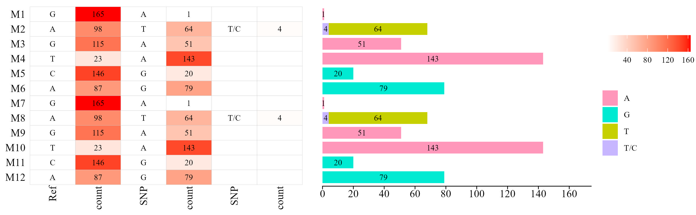

# About
This is a kit to visualize the SNP.  
**Could only support VCF file at source!**  
**Some codes need to be rewrite**, but they are able to use, just they are unclean& beauty for me.

# Demo Figure


# How to use
## stp0, prepare for your data& this kit
To prepare the datas for you project, you must be followd by:
+ Make sure you are in a special, empty folder for this work.
+ Creat a folder named "vcf", move all .vcf file to there.
+ Run bash/cmd/powershell, then run ```git clone https://github.com/DoubleBobCat/SNPVisualize.git```, rename cloned folder to "scripts". Make sure you have already installed the **"Git"** before do that. Or you can download this repositories and handfully unzip codes, move them to a new child folder "scripts".

To prepare for this respositories, keep your bash/cmd/powershell windows, then run ```conda insall requirements.txt```.

## stp1, convert VCF to CSV
In this step, you can convert vcf files to csv files as data, json files as information.

Just makesure your bash/cmd/powershell work folder is the stp1 folder, then run ```python process_vcfSpilit.py```.

After running, a new folder "vcf_split" will be create in you root folder for this work, and there will have two types of file. The "csv" file is stored the SNP data, the "json" file is stored the vcf run info.

## stp2, simplify the SNP data
>This part codes depended on my another project [Py_multiThreaded_csvProcess](https://github.com/DoubleBobCat/Py_multiThreaded_csvProcess), it's not already finished, but also can be used.

In this step, the SNP data will be simplified, the cell for each sample and each place will only keep the gene info.  
Likes if one cell source data is ```G:...```, after running script, this cell will only keep ```G```.

Just makesure your bash/cmd/powershell work folder is the stp2 folder, then run ```python main.py```.

After running, a new folder "csv_first" will be create in you root folder for this work, and there will have csv file to store the simplified SNP.

## stp3, data prepare for draw
In this step, the SNP data will be count. For output, have ```2n+1``` cols. The first col named "POS", the following 2n cols is SNP info. Each 2 cols have a colname started as "value_" means the SNP/REF is, a colname started as "count_" means the count of this SNP/REF, if one cell for POS-id don't have value, it will be "" but no NA.

Just makesure your bash/cmd/powershell work folder is the stp3 folder, then run ```python temp.py``` (Cause I prepared to rewrite this script, but it's useable).

After running, a new folder "csv_second" will be create in you root folder for this work, and there will have csv file to store the data for drawing figure.

## stp4, draw figure
In this step, also the final step, the figure will be draw. For output, the jpg folder will stored the jpg type figure, the csv folder will stored the csv type figure.

Just makesure your bash/cmd/powershell work folder is the root folder for this work, then run ```Rscript stp4.draw.R```.

After running, a new folder "figs" will be create in you root folder for this work, including two folder "jpg" and "svg".